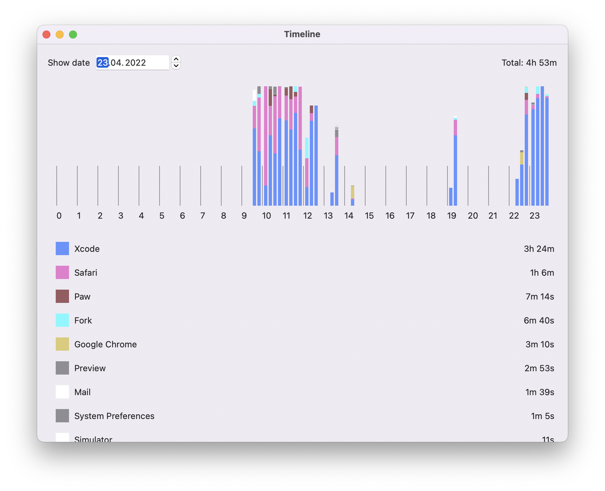

#  Timeline

I am sick of over-complicated time trackers. I want something as simple as a single screen with overview for a whole day, but be able to see it with precision granularity.



## Motivation

I'd like to discovery crossplatform opportunities of Swift language and also learn some SwiftUI. OS X app is ready enough (I use it daily), hopefully I will implement Linux and Windows apps before I run out of luck.   

## Installation

#### macOS

Do not use SPM (no support for macOS app bundles), use xcodeproj instead. SPM is there for the SPM testing purposes

```
open timeline.xcodeproj
```
Data is stored in the `~/Library/Containers/ru.redetection.timeline/Data/Library/Application Support/ru.redetection.timeline/timeline.sqlite`
 
#### Linux

SPM is a way to go. 

```
swift build --product "Timeline-linux"
./.build/debug/Timeline-linux
```

At the moment app expects no remote X windows, only ones from local machine. Data is stored in the `~/.timeline/store.sqlite`
